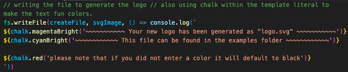

# Janet's SVG Logo Maker

### [View Project Video Here](https:// "Janet's SVG Logo Maker") 

| Technology Used    | Resource URL |
| --------  | ------- |
| NodeJS      | https://nodejs.org/en |
| Inquirer      | https://www.npmjs.com/package/inquirer |
| FS      | https://nodejs.org/api/fs.html |
| Jest      | https://jestjs.io/docs/getting-started |
| Screencastify | https://www.screencastify.com/ |
| JavaScript | https://developer.mozilla.org/en-US/docs/Web/JavaScript |
| Git       | https://git-scm.com/ |
| GitHub     | https://github.com/ |
| VSCode    | https://code.visualstudio.com/ |

## Table of Contents

* [Description](#description)
* [Installation](#installation)
* [Usage](#usage)
* [Credits](#credits)
* [License](#license)

## Description:
This application acts as a wizard to create an SVG logo. 
 

#### How to use this app:

* Recommended Requirements: 
  * Node.JS
  * CLI
  * VSCode 
* Installation:
  * Clone the repo to your device 
  * Initiate NPM 
  * Install inquirer 
  * Install chalk
* Open Integrated Terminal (CLI) 
* type "node index.js" 
* Follow the question prompts until complete 
* Retrieve file from 'examples' folder

#### User Story
- AS a freelance web developer
- I WANT to generate a simple logo for my projects
- SO THAT I don't have to pay a graphic designer

#### Acceptance Criteria
- GIVEN a command-line application that accepts user input
- WHEN I am prompted for text
- THEN I can enter up to three characters
- WHEN I am prompted for the text color
- THEN I can enter a color keyword (OR a hexadecimal number)
- WHEN I am prompted for a shape
- THEN I am presented with a list of shapes to choose from: circle, triangle, and square
- WHEN I am prompted for the shape's color
- THEN I can enter a color keyword (OR a hexadecimal number)
- WHEN I have entered input for all the prompts
- THEN an SVG file is created named `logo.svg`
- AND the output text "Generated logo.svg" is printed in the command line
- WHEN I open the `logo.svg` file in a browser
- THEN I am shown a 300x200 pixel image that matches the criteria I entered

### Lessons Learned

#### 1. TBD
Description
 

#### 2. TBD
Description
 

#### 3. TBD
Description
 

#### 4. TBD
Description
 

#### Synopsis
Description

## Installation

1. Create a new repository on GitHub, to store this project.
2. Clone the repository to your computer.
3. Copy files to your own repository.
4. Follow the steps for "How to" above
5. Make changes to the code.
6. Commit the changes to the local repo.
7. Push the changes to the remote repo.

## Usage

This is a SVG logo generator app. If you would like to use this app follow the installation steps and curate it to your needs. If you would like to use this app to create your SVG logo files, follow the steps under the description above and click the link at the top of this page.

## License

MIT License
Copyright (c) 2023 Twixmixy / Janet Webster

## About The Author
### Janet Webster
Full Stack MERN Software Engineer in training.

- [GitHub](https://github.com/TwixmixyJanet/)
- [LinkedIn](https://www.linkedin.com/in/twixmixy/)
- [Twitter](https://twitter.com/Twixmixy)
- [WakaTime](https://wakatime.com/@Twixmixy)

